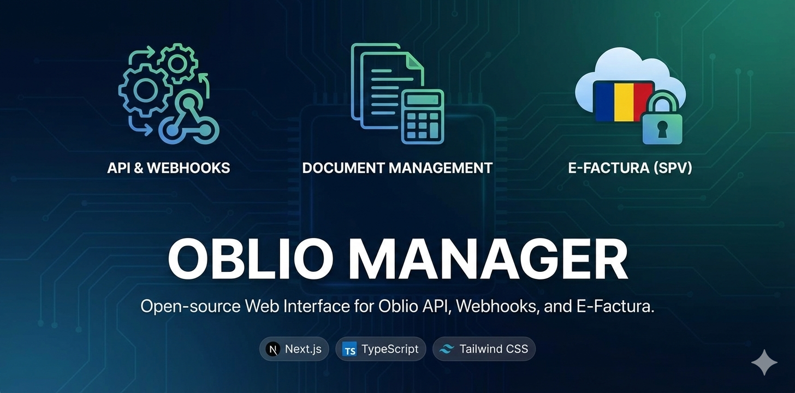

<p align="center">
  
</p>

# Oblio Manager

An open-source web interface for managing [Oblio](https://www.oblio.eu) API and webhooks. This application provides an intuitive UI to interact with the Oblio invoicing platform, manage webhooks, create documents, and handle E-Facturas through the SPV system.


## Features

### Webhooks Management
- Create, view, and delete webhooks
- Support for all Oblio webhook topics (stock updates, invoice events, etc.)
- Real-time webhook monitoring

### Nomenclature Access
- **Companies**: View all associated companies
- **VAT Rates**: Retrieve tax rates by company CIF
- **Clients**: Browse client database with pagination
- **Products**: Access product/service inventory
- **Series**: View document series configurations
- **Languages**: Check available document languages
- **Management**: Access warehouse/inventory areas

### Document Operations
- **Create Documents**: Invoices, Proformas, Delivery Notices
- **List Invoices**: Filter by date range
- **Manage Documents**: View, cancel, restore, or delete documents
- **Rich Forms**: Comprehensive forms with all available parameters

### E-Factura (SPV) Integration
- Send invoices to the Romanian SPV system
- Retrieve E-Factura archives
- SPV status tracking

### Security & Privacy
- All credentials stored locally in browser
- Server-side proxy prevents CORS issues
- Base64 encryption for credentials and tokens in transit
- Token expiration handling
- No database - credentials never stored server-side

## Getting Started

### Prerequisites
- Node.js 20+
- Oblio account with API credentials

### Installation

1. Clone the repository:
```bash
git clone https://github.com/yourusername/oblio-webhooks.git
cd oblio-webhooks
```

2. Install dependencies:
```bash
npm install
```

3. Run the development server:
```bash
npm run dev
```

4. Open [http://localhost:3000](http://localhost:3000) in your browser

### Production Build

```bash
npm run build
npm start
```

## How to Use

### 1. Authentication
On first visit, you'll be prompted to enter:
- **Client ID**: Your Oblio account email
- **Client Secret**: Found in your Oblio account settings

These credentials are stored locally in your browser and used to generate an access token.

### 2. Navigation
Use the collapsible sidebar to navigate between sections:
- **Webhooks**: Main webhook management
- **Nomenclature**: Access lookup data (companies, clients, products, etc.)
- **Documents**: Create and manage invoices, proformas, notices
- **E-Factura**: SPV system integration
- **Settings**: Update credentials or logout

### 3. Creating a Webhook
1. Navigate to Webhooks
2. Click "Create Webhook"
3. Fill in:
   - Company CIF
   - Topic (e.g., `invoice.draft`, `stock.update`)
   - Endpoint URL (must respond with HTTP 200 and echo X-Oblio-Request-Id header)
4. Submit

### 4. Creating an Invoice
1. Navigate to Documents → Create Invoice
2. Fill in company information (CIF, series name)
3. Add client details
4. Set invoice date and optional due date
5. Add products with prices, quantities, and VAT rates
6. Submit to create the invoice

### 5. Managing Access Token
- Tokens expire after 1 hour
- Go to Settings to re-authenticate
- Update credentials anytime from Settings page

## API Reference

This application uses the official [Oblio API](https://www.oblio.eu/api). Key endpoints include:

- `POST /authorize/token` - Authentication
- `GET /nomenclature/*` - Lookup data
- `POST /docs/{type}` - Create documents
- `GET /docs/{type}` - Retrieve documents
- `GET /webhooks` - List webhooks
- `POST /webhooks` - Create webhook
- `DELETE /webhooks/{id}` - Delete webhook

## Architecture

This application uses a **server-side proxy architecture** to handle CORS restrictions:

1. **Client** → Encrypts credentials/token → **Next.js API Routes**
2. **Next.js API Routes** → Decrypts & forwards → **Oblio API**
3. **Oblio API** → Responds → **Next.js API Routes** → **Client**

All sensitive data is base64-encoded during transit between client and server, and credentials are never stored server-side.

## Project Structure

```
oblio-webhooks/
├── app/
│   ├── api/oblio/          # Server-side API routes
│   │   ├── authenticate/   # Authentication endpoint
│   │   └── proxy/          # Proxy for all Oblio API calls
│   ├── documents/          # Document management pages
│   ├── einvoice/           # E-Factura pages
│   ├── nomenclature/       # Nomenclature pages
│   ├── settings/           # Settings page
│   ├── webhooks/           # Webhooks page
│   ├── layout.tsx          # Root layout with metadata
│   └── page.tsx            # Homepage
├── components/             # Reusable React components
│   ├── LoginForm.tsx       # Authentication form
│   ├── PageContainer.tsx   # Page wrapper
│   ├── RequestResponse.tsx # API call display
│   └── Sidebar.tsx         # Navigation sidebar
├── contexts/               # React contexts
│   └── AuthContext.tsx     # Authentication state
├── lib/                    # Utilities and services
│   ├── api.ts             # Oblio API client (uses proxy)
│   ├── crypto.ts          # Encryption utilities
│   ├── storage.ts         # LocalStorage wrapper
│   └── types.ts           # TypeScript types
└── public/                # Static assets
```

## Technology Stack

- **Framework**: Next.js 16 (App Router)
- **Language**: TypeScript 5
- **Styling**: Tailwind CSS 3.4 with PostCSS
- **State Management**: React Context API
- **Storage**: Browser LocalStorage
- **API**: Native Fetch API

## Development

### Code Style
- Clean, readable code with descriptive variable names
- TypeScript for type safety
- Functional components with hooks
- Organized file structure

### Adding New Features
1. Create new page in `app/` directory
2. Add route to sidebar navigation in `components/Sidebar.tsx`
3. Use `PageContainer` for consistent layout
4. Use `RequestResponse` to display API calls
5. Implement proper error handling

## Security Considerations

- **Credentials Storage**: Stored only in browser LocalStorage, never in a database
- **Data in Transit**: All credentials and tokens are base64-encoded when sent to API routes
- **Server-Side Processing**: API routes decrypt, forward to Oblio, and immediately discard sensitive data
- **No Persistence**: Server never stores credentials, tokens, or user data
- **HTTPS**: Enforced in production via Vercel
- **Token Expiration**: Automatic handling prevents stale sessions
- **CORS Protection**: Server-side proxy handles all Oblio API communication
- **Page Refresh Warning**: Prevents accidental data loss

## Contributing

Contributions are welcome! Please feel free to submit a Pull Request. For major changes:
1. Fork the repository
2. Create your feature branch (`git checkout -b feature/AmazingFeature`)
3. Commit your changes (`git commit -m 'Add some AmazingFeature'`)
4. Push to the branch (`git push origin feature/AmazingFeature`)
5. Open a Pull Request

## License

This project is licensed under the **Creative Commons Attribution-NonCommercial 4.0 International License** (CC BY-NC 4.0).

### What this means:
- ✅ **You CAN**: Use this application freely from the hosted Vercel website
- ✅ **You CAN**: Run it locally for personal or organizational use
- ✅ **You CAN**: Modify and adapt the code for your own non-commercial purposes
- ✅ **You CAN**: Share the code with others
- ❌ **You CANNOT**: Sell this software or use it for commercial purposes
- ❌ **You CANNOT**: Offer this as a paid service
- ❌ **You CANNOT**: Use it in any profit-generating activity

**Attribution**: When using or sharing this project, you must give appropriate credit to the original authors.

For the full license text, see the [LICENSE](LICENSE) file or visit [https://creativecommons.org/licenses/by-nc/4.0/](https://creativecommons.org/licenses/by-nc/4.0/).

## Disclaimer

This is an unofficial, open-source tool and is not affiliated with or endorsed by Oblio. Use at your own risk. Always verify critical operations through the official Oblio platform.

---

Built with ❤️
